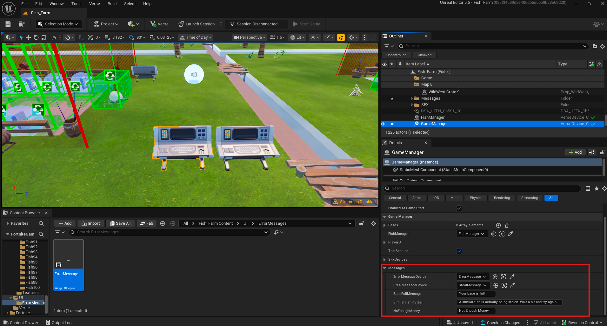

# Guide de Modification du Contenu Rendu Public

Ce document explique comment modifier les éléments rendus publics : **Mesh**, **SFX**, **VFX**, **Stats**, etc.

---

## 1. Fish (Mesh + Stats)

Dans le device `FishManager` placé sur la map, il existe une variable nommée `FishStruct`. Cette variable contient un tableau de `FishStruct`. Chaque struct contient les informations suivantes :

- `FishAsset` : référence du blueprint du poisson.
- `FishPrice` : prix d'achat du poisson par le joueur.
- `FishMoneyPerSec` : revenu généré par seconde par le poisson.

### Modification des visuels du poisson

Pour modifier les visuels d'un poisson, ouvrir son `Blueprint`. Chaque `Blueprint` contient :

- Le `Skeletal Mesh` du poisson avec son animation intégrée.
- Un `Plane` destiné à afficher les informations du poisson.

### Modification des informations affichées au-dessus du poisson

Pour cela, il faut modifier le matériau appliqué au mesh. Procédure :

1. Créer une `Material Instance` à partir de `M_FishPrice` situé ici :  
   `/All/Fish_Farm/Mat/FishPrice`
2. Appliquer cette `Material Instance` au `Plane`.

Cette instance contient deux paramètres modifiables :

- `Scale` : ajuste la taille du rendu de la texture.
- `Texture` : contient l’image à afficher.

### Tutoriel Vidéo

<video src="./Videos/FishModif.mp4" autoplay loop muted controls style="max-width: 100%; height: auto;">
</video>
---

## 2. SFX

**Fichiers concernés :** `.wav`, `.mp3`, `.ogg`

Tous les `SFX` se trouvent ici :  
`/All/Fish_Farm/SFX`, organisés dans des sous-dossiers correspondants.

### Modification d’un SFX

1. Ouvrir le `Sound Cue` associé.
2. Sélectionner le `Wave Player`.
3. Remplacer la référence actuelle par le son souhaité.

### Tutoriel Vidéo

<video src="./Videos/SFXModif.mp4" autoplay loop muted controls style="max-width: 100%; height: auto;">
</video>

---

## 3. VFX

Tous les `VFX` se trouvent ici :  
`/All/Fish_Farm/Niagara`, organisés dans des sous-dossiers correspondants.

### Modification d’un VFX

1. Ouvrir le `Niagara System` associé.
2. Appliquer les modifications nécessaires directement dans l’éditeur.

### Tutoriel Vidéo

<video src="./Videos/VFXModif.mp4" autoplay loop muted controls style="max-width: 100%; height: auto;">
</video>

---

## 4. Messages affiché au joueur

### Modification de l'UI

Le `Widget Blueprint` servant a afficher un message au joueur se trouve ici : `/All/Fish_Farm/UI/ErrorMessages`. Vous vouvez le modifier a votre guise il faut juste faire attention a bien garder la liaison entre le widget et le `HUDMessage`

</img>

### Modification du texte

Dans le device `GameManager` placé sur la map, il existe une variable nommée `Messages`.  
Cette variable contient une struct regroupant :

- Le device HUD Message à utiliser.
- Les textes à afficher pour chaque événement.

</img>
---
